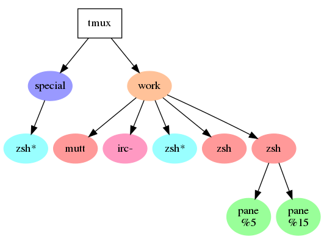

# tmux-dotty

tmux-dotty renders tmux's internal tree structure as a
[dot graph](http://www.graphviz.org/doc/info/lang.html) which can then be
turned into a pretty picture.

There's no practical use for this per se.  But it's fun!

## Licence

BSD 2-clause.  See header of `tmux-dotty`.

## Usage

```
tmux-dotty [-U update interval] [tmux args]...
```

`-U<number>` -- sleep for that long before regenerating the dot output.

## Examples

Using xdot(1) for interactive viewing:

```
tmux-dotty | xdot -
```

Using dot(1) to generate a png:

```
tmux_dotty | dot -Tpng > ./tmux-tree.png
```

Using feh(1) to view the image on-the-fly:

```
tmux_dotty | dot -Tpng | feh -
```

Here's a diagram:



## Contact

Thomas Adam (@ThomasAdam), as well as `thomas_adam` on Freenode IRC.

## Patches Welcome

Yes please!

-- Thomas Adam, Tuesday 5th December 2017
